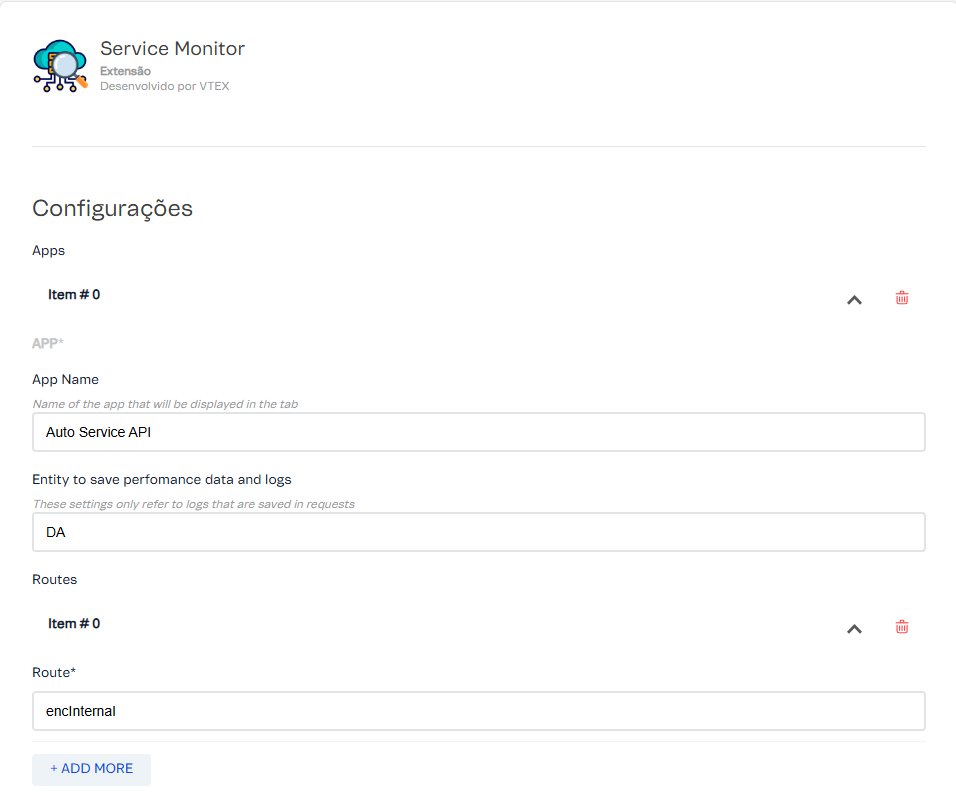
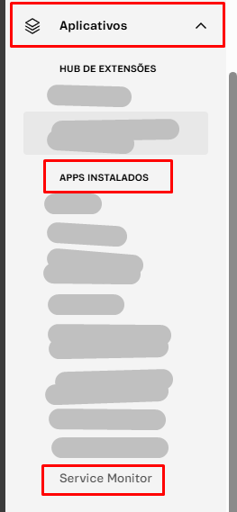
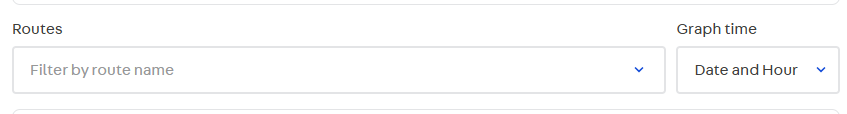
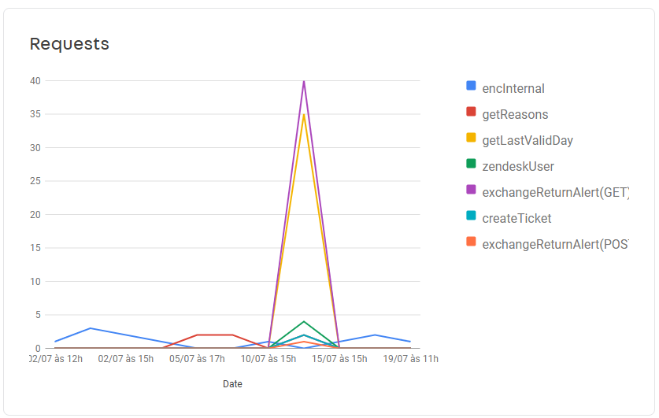
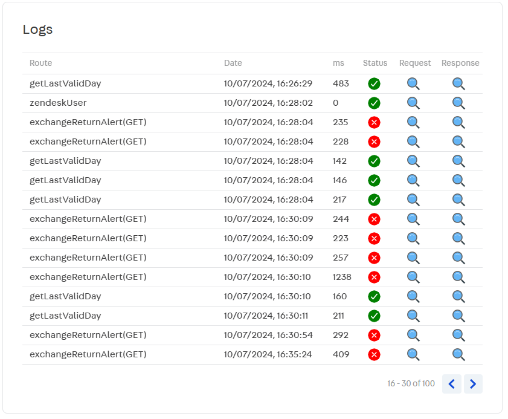
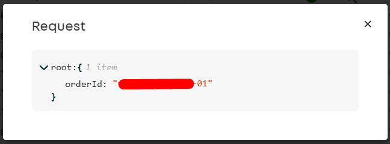
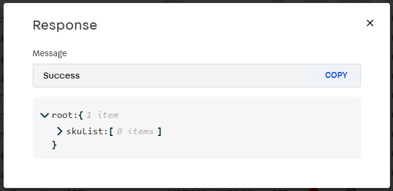

<div style="width: 100%; display: flex; flex-direction: row; justify-content: center;"> 
  
</div>

<div width="100%" style="text-align: center"> 
  <h1>Service Monitor</h1>
</div>

O **Service Monitor** é um aplicativo para análise e visualização de dados e métricas de serviços criados na plataforma VTEX. Este aplicativo oferece um componente de dashboard que apresenta uma visão detalhada do comportamento do app em produção através de gráficos e indicadores claros. Com ele, é possível monitorar o desempenho das rotas, engajamento do usuário e eficiência operacional diretamente no painel administrativo VTEX.

## Pré-requisitos

### Para que a ferramenta funcione, é necessário:

#### 1º - Entidade de dados criada 
Ter uma entidade criada no Masterdata com as seguintes propriedades:

| Name            | Type          | Is filterable? | Is searchable? |
|-----------------|---------------|----------------|----------------|
| authDescription | `Varchar 50`    | **Yes**            | **Yes**            |
| authType        | `Text`          | **-**              | **-**              |
| date            | `Date And Time` | **Yes**            | **Yes**            |
| isError         | `Boolean`       | **Yes**            | **Yes**            |
| msg             | `Text`          | **-**              | **-**              |
| objectReturn    | `Text`          | **No**             | **No**             |
| processingTime  | `Integer`       | **No**             | **No**             |
| requestObject   | `Text`          | **-**              | **-**              |
| routeName       | `Varchar 50`    | **Yes**            | **Yes**            |

#### 2º - Popular a entidade 
O serviço da VTEX estar populando informação na entidade que foi criada com as informações do passo anterior, para isso use a biblioteca **[smonitorpkg](https://github.com/luizbpacct/smonitorpkg)** que foi criada especificadamente para facilitar a população dos dados na entidade acima, no repositório você encontra um tutorial de como adicionar a biblioteca a seu código.

## 🚀 Instalando

> Caso o app ainda não foi publicado execute esses comandos:

```bash
# Baixa as as dependencias dos tipos
$ vtex setup --typings

# Baixa as dependencias
$ yarn

# Faz login na loja
$ vtex login {{ACCOUNT}}

# Acessa ou cria uma WS de `development`
$ vtex use {{WS_NAME}}

# Linka o app na WS
$ vtex link
```

> Caso o app já tenha sido publicado, execute esses comandos

```bash
# Faça o login na sua loja
$ vtex login {{ACCOUNT}}

# Instale com o comando abaixo, substituindo o `@V.x` pela versão desejada
$ vtex install acctglobal.service-monitor-admin-app@V.x
```

## ⚙️ Configurando
Para configurar o app basta entrar nos apps instalados na sua loja ('{{account}}.myvtex.com/admin/apps') e buscar por `service monitor`

Dentro das configurações tera um campo para cadastrar os apps que serão monitorados, tendo os seguintes campos:
- Nome do App
- A entidade do masterdata onde os dados estão sendo registrados;
- As rotas que o seu app registra para conseguir realizar os filtros na aplicação.




## ☕ Como utilizar

Na barra alteral do admin da sua loja, entre aba `Aplicativos` e na Divisão `Apps Instalados` busque pelo menu `Service Monitor`



Quando a pagina é acessada, ele exibe uma tab para cada app que foi cadastrado nas [configurações](#️-configurando) e cada tab é separada pelas seguntes seções:

### Filtro de logs
Logo no inicio, temos as opções de `Filtragem por data` nesses campos são inceridos a data inicial e final que os logs foram registrados:


### Paginação
Por se tratar de uma quantidade consideravel de logs, foi adicionado um sistema de paginação que busca da VTEX as informações por pagina, ou seja, não busca todos os registros do periodo de uma vez mas sim por pagina no limite de registros que foi configurado no campo `show registers`, e para navegar entre as paginas, basta utilizar os botões do lado direito, isso foi construido visando um melhor desempenho da pagina.


### Rotas
Nessa sessão é listado as rotas que foram cadastradas no campo de rotas na [configuração](#️-configurando) do app, nele é possivel filtrar a requisição que é feita no na base de dados a a partir das rotas selecionadas. No campo `Graph time` é o formato que os graficos abaixo seram exibidos, sendo por data ou por data e hora.



### Gráficos
 A partir dos dados obtidos na entidade de dados, é plotado dois graficos na tela o de `Erros` e o de `Requisições` sendo que os dois usam os registros que foram obtidos a partir do range de data que foi selecionado e na paginação atual.

 
 
 

 ### Logs
 Também a partir dos registros que foram obtidos a partir do range de data que foi selecionado e da paginação atual, é exibido uma listagem de todos os logs registrados na entidade (linha a linha) e em cada linha é possivel observar as seguintes informarções:
 - Nome da rota
 - Data e hora do registro
 - Tempo de processamento em milessegundos
 - Status da requisição se foi de erro ou não
 - O Objeto que foi enviado para a requisição
 - O Objeto de resposta da requisição e em caso de erro é exibida também a mensagem de erro (caso haja).

 





## Icones utilizados
- <a href="https://www.flaticon.com/free-icons/server" title="server icons">Server icons created by RaftelDesign - Flaticon</a>
- <a href="https://www.flaticon.com/free-icons/search" title="search icons">Search icons created by Maxim Basinski Premium - Flaticon</a>

